# 🦌 鹿管插件

<div align="center">


**群友 🦌 绩签到 · 天象联动 · 八职业配额 · 互害恶趣 · 鹿王册封**

<br>

[](https://github.com/sunflowermm/XRK-Yunzai)
[](https://nodejs.org/)
[](https://redis.io/)
[](#)

*向日葵 / XRK-Yunzai 维护版 · 基于 nonebot-plugin-deer-pipe 生态二次开发*

</div>

---

## 目录

- [界面预览](#界面预览)
- [这是什么](#这是什么)
- [安装与依赖](#安装与依赖)
- [新手一日流程](#新手一日流程)
- [界面详解](#界面详解)
- [八职业体系](#八职业体系)
- [鹿林天象](#鹿林天象)
- [核心机制](#核心机制)
- [指令大全](#指令大全)
- [排行榜与鹿王](#排行榜与鹿王)
- [数据与配置](#数据与配置)
- [渲染技术](#渲染技术)
- [项目结构](#项目结构)
- [鸣谢与许可](#鸣谢与许可)

---

## 界面预览

> 以下截图为 Bot 实际出图样例（见 [`docs/images/`](docs/images/)）。部署后发送对应指令即可获得同类图片。  
> 重新导出预渲染图（在 XRK-Yunzai 根目录）：  
> `node plugins/yunzai-plugin-deer-pipe/scripts/export-prebuilt-images.mjs`  
> 产出 `assets/prebuilt/`（Bot 运行时直读）并镜像到 `docs/images/`（README 用）

### 鹿况 · 帮助 · 职业

| 鹿况面板 `鹿况` | 职业一览 `鹿职业` |
|:---:|:---:|
| 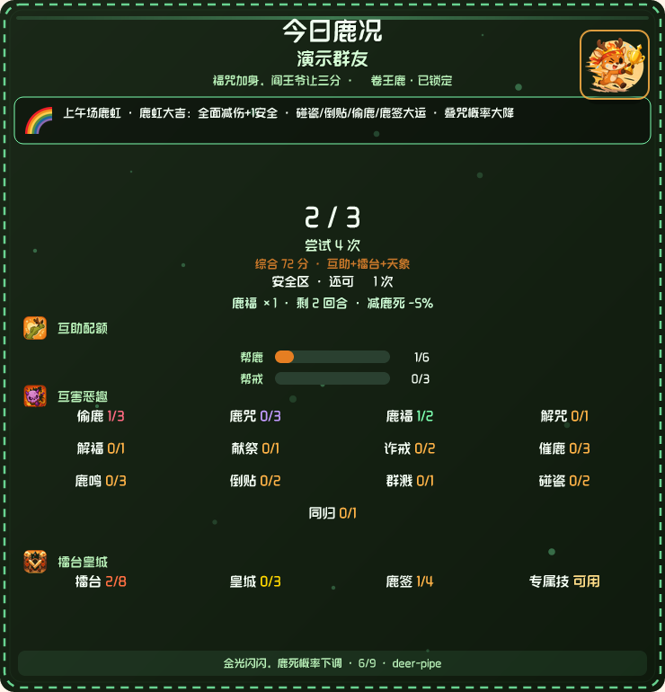 | 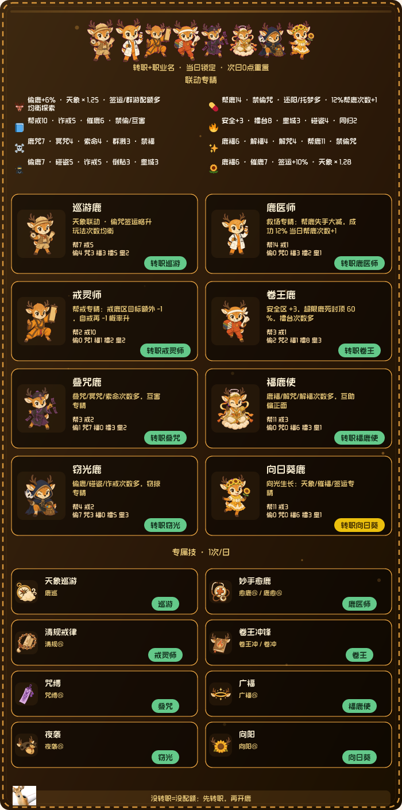 |

| 鹿帮助 · 活鹿篇 `鹿帮助` | 鹿帮助 · 冥界篇 |
|:---:|:---:|
| 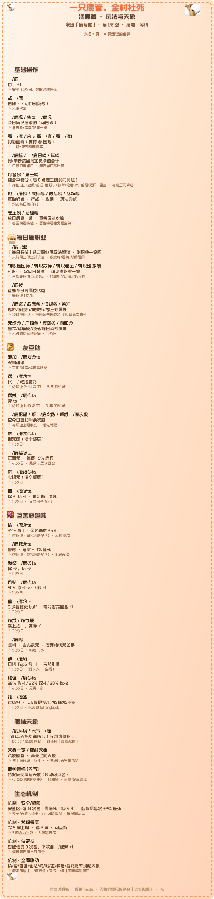 | 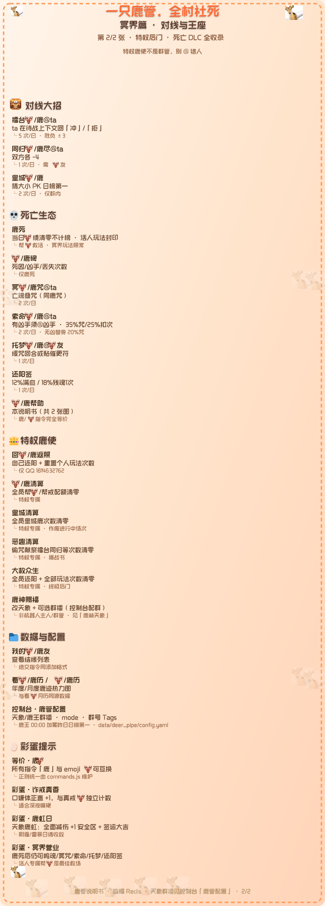 |

| 卷王鹿 `转职卷王` | 窃光鹿 `转职窃光` | 鹿医师 `转职医师` |
|:---:|:---:|:---:|
| 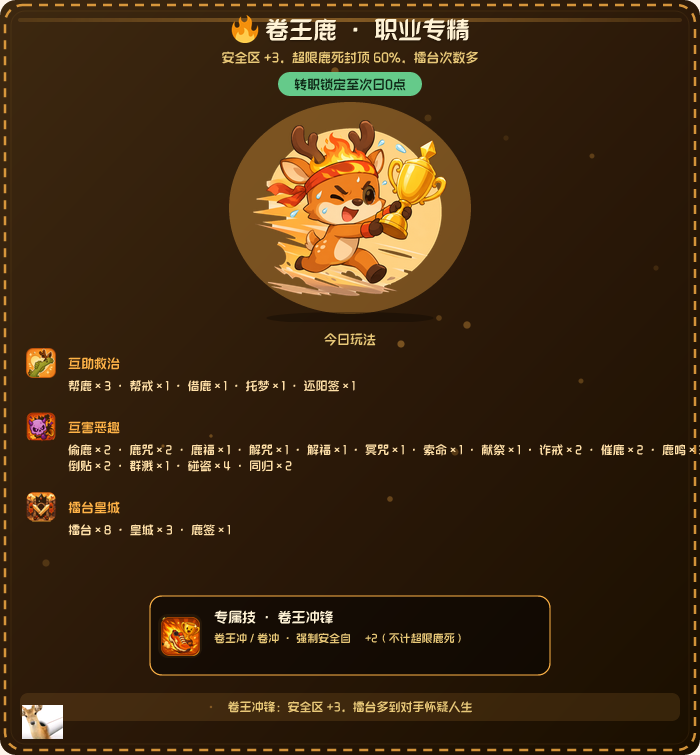 | 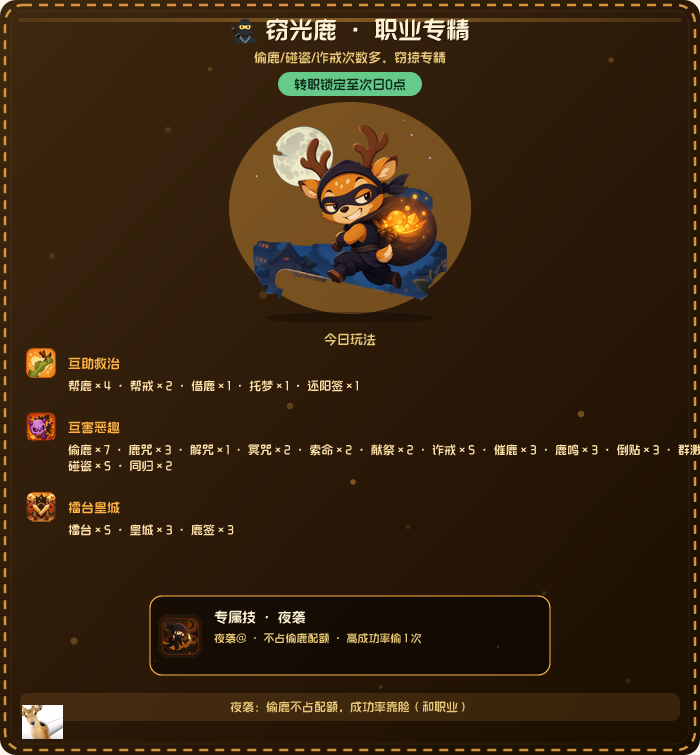 | 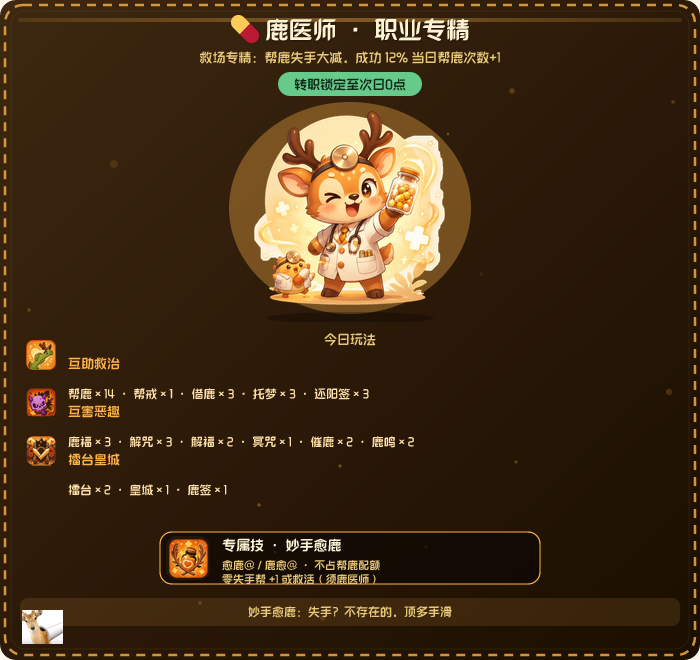 |

| 向日葵鹿 `转职向日葵` |
|:---:|
| 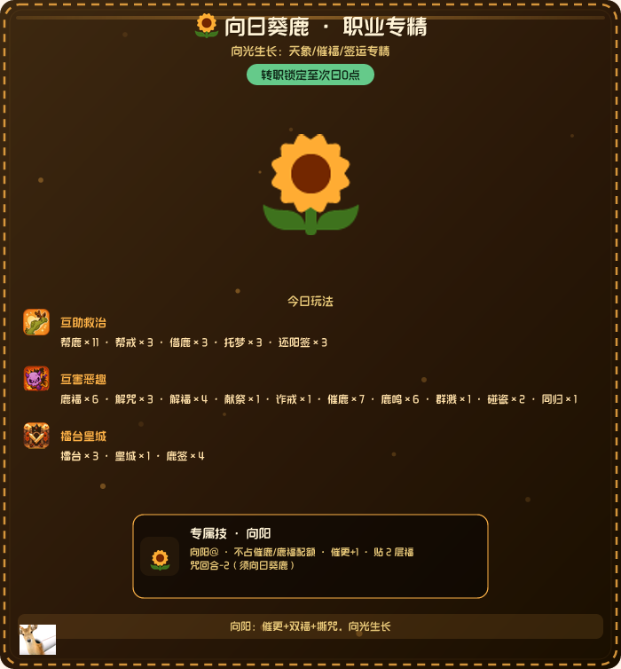 |

### 天象 · 玩法卡

| 鹿虹 `鹿环境` | 雷暴 | 阴霾 |
|:---:|:---:|:---:|
| 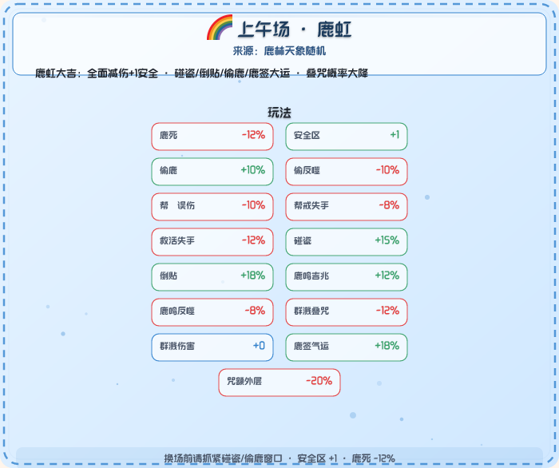 | 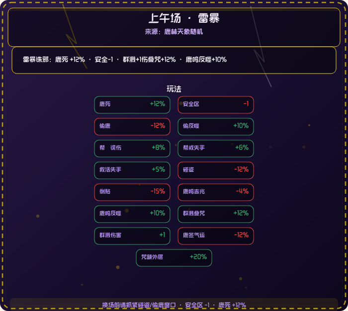 | 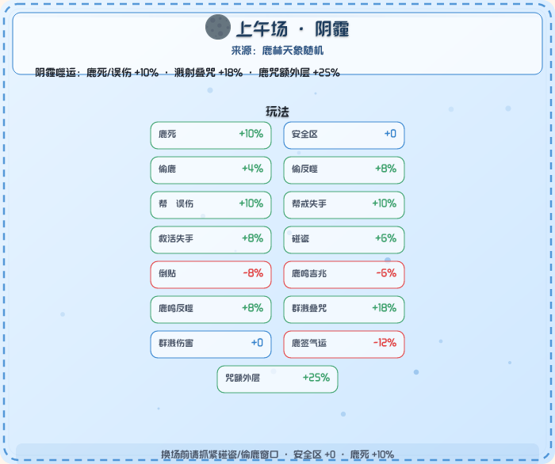 |

| 晴朗 | 细雨 |
|:---:|:---:|
| 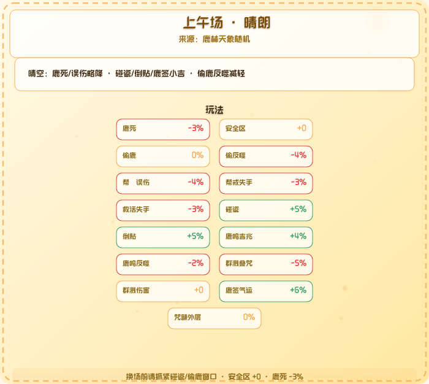 | 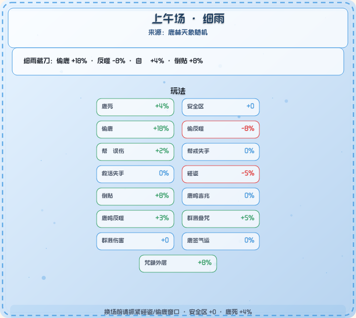 |

| 偷鹿得手 `偷鹿@` | 叠咒 `鹿咒@` |
|:---:|:---:|
|  |  |

---

## 这是什么

**鹿管**（`yunzai-plugin-deer-pipe`）是运行在 QQ / OneBot 群里的 **🦌 绩签到 + 轻量社交博弈** 插件：

| 维度 | 说明 |
|------|------|
| **签到** | `鹿` / `🦌` 自 🦌 +1；`戒鹿` 自律 −1（可负） |
| **职业** | 每日 **`转职xxx`** 解锁不同玩法配额与被动；**未转职 = 全部玩法封印** |
| **天象** | 每 12 小时换场，全局修正鹿死、偷、帮、签运等 15+ 维度 |
| **互助** | 🦌 友双向结缘；`帮鹿@` / `帮戒鹿@` 代操作或救活 |
| **互害** | 偷咒、碰瓷、群溅、擂台、皇城等「恶趣」玩法 |
| **冥界** | 鹿死后仍可冥咒、索命、托梦、还阳签；活人 `帮鹿` 是主救场 |
| **鹿王** | 每日 0:00 按 **综合平衡分** 册封昨日日榜第一 |

**指令等价**：全文 **`鹿`** 与 emoji **`🦌`** 完全互换（`constants/commands.js` 统一正则）。

**最完整玩法说明**：群内发送 **`鹿帮助`**（2 张长图，与 [`help-catalog.js`](constants/help-catalog.js) 同源）。

---

## 安装与依赖

在 **XRK-Yunzai 根目录**：

```bash
git clone --depth=1 https://github.com/sunflowermm/yunzai-plugin-deer-pipe ./plugins/yunzai-plugin-deer-pipe/
cd plugins/yunzai-plugin-deer-pipe && npm install
```

| 依赖 | 用途 |
|------|------|
| `sharp` | PNG 合成、Twemoji 栅格、贴图 trim |
| `@resvg/resvg-js` | SVG 文字渲染，加载 `assets/Genshin.ttf`（librsvg **不支持** SVG 内嵌字体） |

重启 Bot 后生效。排行榜 / 🦌 友列表等 HTML 页走框架 **RendererLoader**（Puppeteer），模板在 `resources/html/`。

**贴图自检**：启动时 `verifyArtManifest()` 检查 `assets/`；向日葵等 emoji 职业无独立 PNG，自动豁免。

---

## 新手一日流程

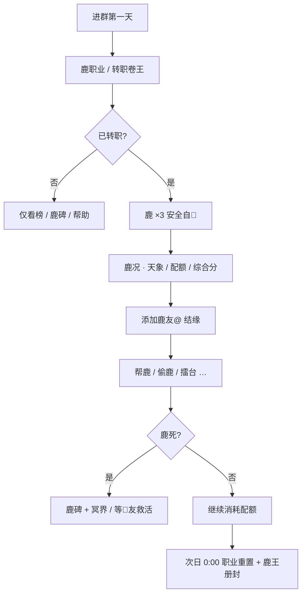

> 节点文案含 `@` 或 emoji 时需用双引号包裹，否则 GitHub Mermaid 会解析失败。

**最短路径（约 30 秒）**

| 步骤 | 指令 | 得到什么 |
|:----:|------|----------|
| 1 | `鹿职业` | 八职业一览图（联动专精 + 专属技） |
| 2 | `转职卷王` 等 | **当日锁定**职业与配额 |
| 3 | `鹿` | 安全区自 🦌（默认前 3 次零鹿死；卷王 +3） |
| 4 | `鹿况` | 天象、咒福、互助条、玩法分区 |
| 5 | `鹿帮助` | 双页说明书（与群内出图同源） |

---

## 界面详解

### 今日鹿况 · `鹿况`


| 区域 | 内容 |
|------|------|
| 标题区 | 昵称、心情 emoji（Twemoji）、职业与锁定状态 |
| 天象条 | 左侧天气 emoji + 换行 tip，面板自适应高度 |
| 计数区 | 安全区 `2/6` 或戒鹿区 / 高危区 / 鹿死丢失 |
| 综合分 | 与 **综合榜 / 0 点鹿王** 同算法 |
| 互助配额 | `help` 分区图标 + 帮鹿 / 帮戒进度条 |
| 玩法分区 | **互害恶趣** / **擂台皇城** 两节，图标与标题左对齐 |
| 底栏 | 随机 flavor + 日期 |

支持 `@某人 鹿况` 围观（不泄露隐私键值，仅展示面板数据）。

### 八职业一览 · `鹿职业`


| 区域 | 内容 |
|------|------|
| 顶栏 | 横幅 / 当前职业 · 今日互助剩余（若已转职） |
| 联动专精 | 八职业 emoji + 专精 tip（自动换行） |
| 职业格 | 立绘或 emoji、**标题 / 描述 / 配额** 分层间距，格高自适应 |
| 专属技 | 八技图标、指令（`🦌` 混排 Twemoji）、所属职业 |
| 铺底 | 空白区半透明 `deerpipe@100x82` 水印 |
| 底栏 | 「没转职=没配额：先转职，再开鹿」 |

### 单职业卡 · 转职后 / `鹿职业`（已转职时）

已转职用户发送 `鹿职业` 会收到 **个人职业卡**（含今日配额进度条），未转职则收到上表一览图。

### 鹿林天象 · `鹿环境`


展示当前象的 **15 维修正**（鹿死、安全、偷、误伤、碰瓷、鹿签等）。八象各自配色与特效（雷暴闪电、鹿虹弧、雨雪粒子等）。`天象一览` 为八象图鉴并高亮当前场次。

### 说明书 · `鹿帮助`


- 指令行内 **`🦌` / ☀️ 等** 走 Twemoji 栅格，不再出现黑块或空白  
- 分区标题旁为 `stickers/sections/` 贴图（互助 / 恶趣 / 擂台 / 职业）  
- 页边与页脚铺半透明鹿标，减少大块留白  

---

## 八职业体系

### 立绘一览

| | | | |
|:---:|:---:|:---:|:---:|
|  |  |  |  |
| 巡游鹿 | 鹿医师 | 戒灵师 | 卷王鹿 |
|  |  |  | 🌻 向日葵鹿 |
| 叠咒鹿 | 福鹿使 | 窃光鹿 | 彩蛋 · 无 PNG |

### 职业对照表

| 职业 | 转职指令 | 定位 | 专属技 | 关键被动 |
|------|----------|------|--------|----------|
| 🦌 巡游鹿 | `转职巡游` | 均衡探索 | `鹿巡` | 天象 ×1.25 · 偷 +6% · 签运 +5% |
| 💊 鹿医师 | `转职鹿医师` | 救场奶 | `愈鹿@` | 帮鹿失手大减 · 12% 帮鹿次数+1 |
| 📘 戒灵师 | `转职戒师` | 帮戒专精 | `清规@` | 帮戒 10 次 · 30% 再 -1 |
| 🔥 卷王鹿 | `转职卷王` | 高位卷 | `卷冲` | 安全 +3 · 超限鹿死 **≤60%** |
| ☠️ 叠咒鹿 | `转职叠咒` | 互害咒师 | `咒缚@` | 鹿咒 7 · 冥咒 4 · 索命 4 |
| ✨ 福鹿使 | `转职福鹿使` | 正面互助 | `广福@` | 鹿福 6 · 解福/解咒多 |
| 🥷 窃光鹿 | `转职窃光` | 窃掠 | `夜袭@` | 偷鹿 7 · 碰瓷 5 · 诈戒 5 |
| 🌻 向日葵鹿 | `转职向日葵` | 天象/签运 | `向阳@` | 天象 ×1.28 · 签运 +10% · 催福专精 |

**规则**：

- 首次 `转职xxx` 后 **当日锁定**，次日 **0:00** 重置，需重新转职  
- **`没转职 = 没配额`**：互助、偷咒、擂台等全部次数为 0  
- 专属技 **`鹿技`** 查状态；多数 **1 次/日** 且 **不占** 对应玩法配额  

### 各职业玩法配额（每日上限）

> 完整键名见 `constants/profession-quotas.js` · `PROFESSION_QUOTA_TABLE`

<details>
<summary><b>🦌 巡游鹿</b> — 均衡偏探索</summary>

| 帮鹿 | 帮戒 | 偷鹿 | 鹿咒 | 鹿福 | 擂台 | 皇城 | 鹿鸣 | 鹿签 |
|:---:|:---:|:---:|:---:|:---:|:---:|:---:|:---:|:---:|
| 7 | 5 | 4 | 3 | 3 | 5 | 2 | 6 | 3 |

</details>

<details>
<summary><b>💊 鹿医师</b> — 帮鹿/解咒/还阳，禁偷咒</summary>

| 帮鹿 | 帮戒 | 偷鹿 | 鹿咒 | 解咒 | 借鹿 | 托梦 | 还阳签 |
|:---:|:---:|:---:|:---:|:---:|:---:|:---:|:---:|
| 14 | 1 | 0 | 0 | 3 | 3 | 3 | 3 |

</details>

<details>
<summary><b>📘 戒灵师</b> — 帮戒/诈戒/催鹿</summary>

| 帮鹿 | 帮戒 | 诈戒 | 催鹿 | 帮戒再-1 |
|:---:|:---:|:---:|:---:|:---:|
| 2 | 10 | 5 | 6 | 30% 概率 |

</details>

<details>
<summary><b>🔥 卷王鹿</b> — 擂台/皇城/碰瓷</summary>

| 帮鹿 | 擂台 | 皇城 | 碰瓷 | 同归 | 安全加成 |
|:---:|:---:|:---:|:---:|:---:|:---:|
| 3 | 8 | 3 | 4 | 2 | +3 次 |

</details>

<details>
<summary><b>☠️ 叠咒鹿</b> — 咒/冥咒/索命/群溅</summary>

| 鹿咒 | 冥咒 | 索命 | 群溅 | 献祭 | 同归 |
|:---:|:---:|:---:|:---:|:---:|:---:|
| 7 | 4 | 4 | 3 | 3 | 2 |

</details>

<details>
<summary><b>✨ 福鹿使</b> — 福/解福/解咒/帮鹿</summary>

| 帮鹿 | 鹿福 | 解福 | 解咒 | 催鹿 |
|:---:|:---:|:---:|:---:|:---:|
| 11 | 6 | 4 | 4 | 5 |

</details>

<details>
<summary><b>🥷 窃光鹿</b> — 偷/碰瓷/诈戒</summary>

| 偷鹿 | 碰瓷 | 诈戒 | 倒贴 | 群溅 |
|:---:|:---:|:---:|:---:|:---:|
| 7 | 5 | 5 | 3 | 3 |

</details>

<details>
<summary><b>🌻 向日葵鹿</b> — 催福签运向光</summary>

| 帮鹿 | 鹿福 | 催鹿 | 鹿鸣 | 鹿签 | 借鹿 |
|:---:|:---:|:---:|:---:|:---:|:---:|
| 11 | 6 | 7 | 6 | 4 | 3 |

**向阳@**：催更 +1 · 鹿福 2 层 · 咒回合最多 −2（不占催鹿/鹿福配额）

</details>

---

## 鹿林天象

**换场**：每日 **00:00 / 12:00** · 全局一条 Redis 状态 · 群内可配置换场群播（控制台「鹿管配置」）。

| 天象 | emoji | 权重 | 一句话 tip |
|------|:-----:|:----:|------------|
| 晴朗 | ☀️ | 18 | 鹿死/误伤略降 · 碰瓷/倒贴/鹿签小吉 |
| 细雨 | 🌧️ | 14 | 偷鹿 +18% · 自🦌 +4% · 倒贴 +8% |
| 瑞雪 | ❄️ | 12 | 鹿死 −8% · 安全 +1 · 互助大减伤 |
| 雷暴 | ⛈️ | 12 | 鹿死 +12% · 安全 −1 · 群溅叠咒 +12% |
| 鹿雾 | 🌫️ | 14 | 偷/碰瓷/倒贴大减 · 自🦌 +6% |
| 祥风 | 🍃 | 14 | 安全 +2 · 碰瓷/倒贴/鹿鸣/鹿签全面加成 |
| 阴霾 | 🌑 | 12 | 鹿死/误伤 +10% · 溅射叠咒 +18% |
| 鹿虹 | 🌈 | 4 | **彩蛋大吉** · 全面减伤 +1 安全 · 签运大运 |

指令：`鹿环境` / `天气鹿` · `天象一览` / `鹿林天象` · 特权 `鹿神赐福 [天气]`（覆写至换场）。

职业 **巡游 ×1.25**、**向日葵 ×1.28** 与天象修正 **叠乘**。

---

## 核心机制

### 安全区 · 超限 · 鹿死

| 机制 | 数值 |
|------|------|
| 默认安全自 🦌 | 前 **3** 次零鹿死（+ 职业 `safeBonus` + 天象 `safeBonus`） |
| 超限鹿死 | 第 4 次起 **12%**，每多发 **+2.2%** |
| 卷王封顶 | 超限鹿死概率 **≤ 60%** |
| 帮鹿失手 | **10%** 起（职业 `helpFailDelta` 修正） |
| 帮戒失手 | **30%**（仍消耗配额） |
| 鹿死 | 当日 🦌 绩 **清零不计榜** · 活人玩法封印 · 🦌 友 `帮鹿` 救活 |

### 咒 · 福 · 催更

| 状态 | 规则 |
|------|------|
| **鹿咒** | 每层 +10% 鹿死 · 最多 5 层 / 3 回合 · ≥3 层「天咒」 |
| **鹿福** | 每层 −5% 鹿死 · 最多 3 层 / 3 回合 |
| **催更符** | 对 0 次者下次自 🦌 / 被帮 **+1**；催带咒目标 = 咒回合 −1 |
| **互解** | `解鹿咒@` / `解鹿福@` 清全部层（🦌 友 + 配额） |

### 综合平衡分（鹿王 / 综合榜）

```
综合分 ≈ 正净值(主权重, cap 12)
        + 施助(帮鹿/帮戒/愈鹿/向阳等)
        + sqrt(玩法尝试) 边际递减
        − 超限 soft/hard 双段扣分
        + 受助侧低权重(防躺赢)
```

详见 [`constants/balanced-score.js`](constants/balanced-score.js)。**鹿况图**与 **综合榜**、**0:00 册封** 同源。

### 鹿死 · 冥界 DLC

| 指令 | 说明 |
|------|------|
| `鹿碑` | 死因 / 凶手 / 丢失次数 |
| `冥鹿咒@` | 亡魂叠咒 |
| `索命鹿@` | 有凶 @ 凶手 · 概率咒/扣次 |
| `托梦鹿@` | 缓咒或贴催更符 |
| `还阳签` | 概率满血 / 残魂 1 次 |
| `帮鹿@` | **活人**主救场（医师 `愈鹿@` 更强） |

---

## 指令大全

<details>
<summary><b>基础 · 互助 · 数据</b></summary>

| 指令 | 作用 |
|------|------|
| `鹿` / `🦌` | 自 🦌 +1 |
| `戒鹿` | 自律 −1 |
| `鹿况` / `@ta 鹿况` | 今日鹿况图 |
| `看鹿` / `看鹿6` / `看鹿2025-06` | 月历（💀=鹿死格） |
| `鹿历` / `看鹿历` / `鹿历6` | 年历 / 月历热力 |
| `添加鹿友@` / `我的鹿友` / `绝交鹿友@` | 🦌 友（一次双向） |
| `帮鹿@` / `帮戒鹿@` | 代 🦌 / 帮戒 |
| `鹿配额` / `帮鹿次数` / `帮戒鹿次数` | 互助剩余 |
| `解鹿咒@` / `鹿福@` / `解鹿福@` / `借鹿@` | 解咒 / 贴福 / 解福 / 借鹿 |

</details>

<details>
<summary><b>职业 · 专属技</b></summary>

| 指令 | 作用 |
|------|------|
| `鹿职业` | 一览图 / 个人职业卡 |
| `转职鹿医师` / `转职戒师` / `转职卷王` / `转职巡游` / `转职叠咒` / `转职福鹿使` / `转职窃光` / `转职向日葵` | 转职 |
| `鹿技` | 专属技状态 |
| `鹿巡` | 巡游 · 天象正向 ×1.35 |
| `愈鹿@` / `鹿愈@` | 医师 · 零失手帮/救 |
| `清规@` | 戒师 · 零失手帮戒 −2 |
| `卷王冲` / `卷冲` | 卷王 · 安全 +2 |
| `咒缚@` / `广福@` / `夜袭@` / `向阳@` | 叠咒 / 福使 / 窃光 / 向日葵 |

</details>

<details>
<summary><b>互害 · 恶趣</b></summary>

| 指令 | 作用 |
|------|------|
| `偷鹿@` | 35% 偷 1 · 带咒每层 +5% · 反噬 20% |
| `鹿咒@` | 叠咒 +10% 鹿死/层 |
| `献祭鹿@` | 你 −2 ta +2 |
| `倒贴鹿@` | 50% 你+1 ta−1 / 败 −1 |
| `催鹿@` | 0 次者叠催更 buff |
| `诈戒` | 口嫌体正直 +1 |
| `鹿鸣` | 嚎叫 · 吉兆/反噬 |
| `群鹿溅` | 日榜 Top5 各 −1 |
| `碰瓷鹿@` | 碰瓷三态概率 |
| `抽鹿签` | 运势签 |

</details>

<details>
<summary><b>对线 · 排行 · 特权</b></summary>

| 指令 | 作用 |
|------|------|
| `擂台鹿@` | 上下文「冲」/「拒」 |
| `同归鹿尽@` | 双方各 −4 |
| `皇城鹿` | 猜大小 PK 日榜第一 |
| `鹿榜` / `日榜` / `年榜` | 净值榜 |
| `综合榜` / `鹿王榜` | 综合分 |
| `奶鹿榜` / `戒师榜` / `救活榜` / `活跃榜` / `卷王榜` / `恶趣榜` | 专项榜 |
| `回鹿返照` / `鹿清算` / `皇城清算` / `恶趣清算` / `大赦众生` | 特权鹿使 |
| `鹿神赐福 [天气]` | 覆写天象 |

</details>

> 概率与次数以 **`constants/game.js`** 及群内 **`鹿帮助`** 图为准（随版本迭代）。

---

## 排行榜与鹿王

| 榜单 | 统计口径 |
|------|----------|
| 鹿榜 / 日 / 年 | 当月正负净值（日榜看当日；**鹿死日不计**） |
| 综合榜 / 鹿王榜 | 综合平衡分 |
| 奶鹿榜 | 施助 / 救活 |
| 戒师榜 | 帮戒次数 |
| 救活榜 | 救活成功 |
| 活跃榜 | 玩法尝试 |
| 卷王榜 | 单日最高 🦌 绩 |
| 恶趣榜 | 偷咒擂台等互害 |

**0:00 鹿王册封**：对昨日 **日榜综合分第一** 加冕（可配置群播 · `data/deer_pipe/config.yaml`）。

---

## 数据与配置

| Redis 键 | 用途 |
|----------|------|
| `Yz:deer_pipe:sign` | 月维度签到与玩法数据（自 `Yz:deer_pipe:core:sign` 迁移） |
| `Yz:deer_pipe:friends` | 🦌 友双向关系 |
| `Yz:deer_pipe:weather` | 鹿林天象 |
| `Yz:deer_pipe:help_log` | 帮鹿/帮戒永久日志 |
| `Yz:deer_pipe:king_archive` | 鹿王加冕存档 |
| `Yz:deer_pipe:prof_reset_sent` | 0 点职业重置群播去重 |

**控制台** → `鹿管配置`：天象群播群号、鹿王 mode、特权 QQ 等。

---

## 渲染技术

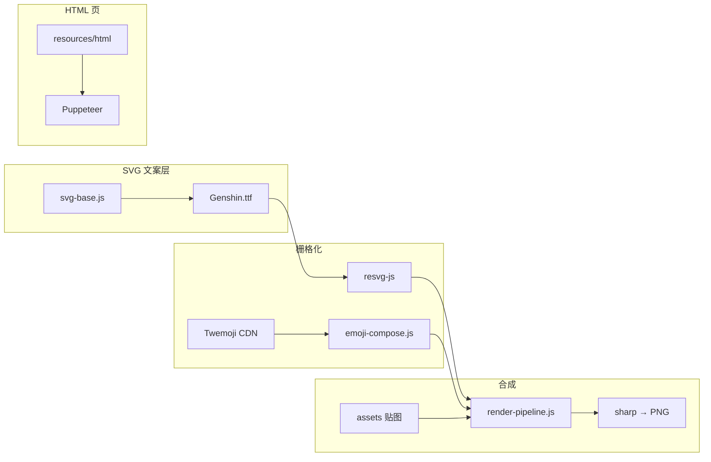

| 模块 | 职责 |
|------|------|
| `svg-base.js` | 主题、配额条、`buildSideArtCell` 自适应格、`buildSectionTitleRow` 左对齐节标题 |
| `emoji-compose.js` | Twemoji 栅格、`buildInlineEmojiText` 混排、`buildCenteredEmojiTitleRaster` |
| `sticker-compose.js` | 立绘 / 分区 / 鹿标加载，`scatterDeerMarkOverlays` 铺底水印 |
| `render-pipeline.js` | Resvg 字体注入 + Sharp 多层合成 |

| 出图类型 | 运行时 | 预渲染 |
|----------|--------|--------|
| 鹿帮助（2 页） | `resolveHelpImages()` | `assets/prebuilt/help/` |
| 职业一览（无快照） | `resolveProfessionCatalogImage()` | `assets/prebuilt/profession/catalog.png` |
| 转职职业卡 | `resolveProfessionCard(id)` | `assets/prebuilt/profession/card-*.png` |
| 天象详情 `鹿环境` | `resolveWeatherDetailImage()` | `assets/prebuilt/weather/{id}-am\|pm.png` |
| 鹿况 / 月历 / 玩法卡 | 实时渲染 | —（含用户数据） |

**预渲染导出**（改 UI 后跑一次，提交 Git）：

```bash
# 在 XRK-Yunzai 根目录
node plugins/yunzai-plugin-deer-pipe/scripts/export-prebuilt-images.mjs
```

产出 `assets/prebuilt/` + 镜像 `docs/images/`。Bot 默认 `render.prefer_prebuilt: true`；调试实时出图可设环境变量 `DEER_PIPE_FORCE_LIVE_RENDER=1`。

---

## 项目结构

```
yunzai-plugin-deer-pipe/
├── apps/                 # 插件入口（core / rank / friends …）
├── constants/
│   ├── commands.js       # 指令正则唯一源
│   ├── profession.js     # 八职业 + 专属技
│   ├── profession-quotas.js
│   ├── help-catalog.js   # 鹿帮助双页文案
│   ├── weather.js        # 八象天象
│   ├── game.js           # 全局概率与配额
│   └── balanced-score.js # 综合分权重
├── utils/
│   ├── svg-base.js           # 布局 / 主题 / 自适应单元格
│   ├── emoji-compose.js      # Twemoji + 混排文案
│   ├── sticker-compose.js    # 贴图 + 鹿标铺底
│   ├── render-pipeline.js    # Resvg + Sharp 合成
│   ├── core.js               # 鹿况 / 月历
│   ├── profession-render.js  # 职业一览 / 职业卡
│   ├── card-render.js        # 玩法卡 / 天象卡
│   └── help-render.js        # 鹿帮助双页
├── assets/
│   ├── Genshin.ttf
│   ├── professions/          # 职业立绘 + catalog 横幅
│   └── stickers/             # 专属技 / 分区图标
├── docs/images/              # README 用出图样例
└── resources/html/           # Puppeteer 模板
```

---

## 鸣谢与许可

| 来源 | 链接 |
|------|------|
| 原创 nonebot 插件 | [nonebot-plugin-deer-pipe](https://github.com/SamuNatsu/nonebot-plugin-deer-pipe) |
| Yunzai 移植参考 | [yunzai-plugin-deer-pipe](https://github.com/zhiyu1998/yunzai-plugin-deer-pipe) |
| 向日葵插件生态 | [XRK-plugin](https://github.com/sunflowermm/XRK-plugin) |
| 维护框架 | [XRK-Yunzai](https://github.com/sunflowermm/XRK-Yunzai) |

沿用原插件 **LICENSE**；二次修改遵循 XRK-Yunzai 社区维护约定。

---

<div align="center">

**一只鹿管，全村社死** 🦌

发送 **`鹿帮助`** 获取最新完整玩法图 · Issue / PR 欢迎

</div>
